# Create an instance that will serve as a web server

on the created instance, attach 3 volumes each containing 10gib and attach it to the AZ of the created instance

`lsblk` [^5]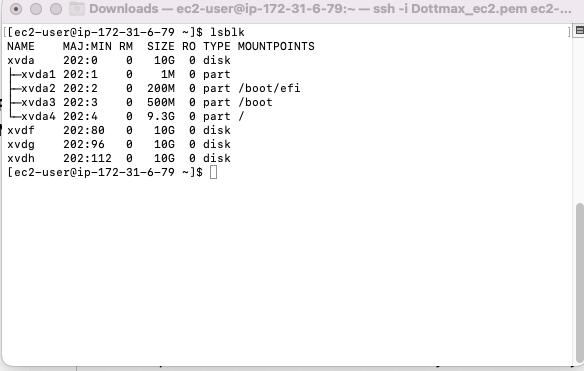

[^5]: This is done to view how the volumes are attached on the server

`ls /dev` [^9]

[^9]:This command shows the newly created volumes

`df -h` [^13]

# create a partition for each volume created

[^13]:This command shows how the volumes are mounted and the number of spaces

`gdisk /dev/xvdf` [^19]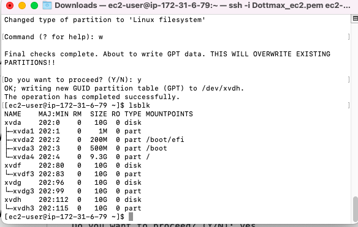

[^19]:This command is used to create a single partition on the created volumes,so we do the same for each volume created

# Install logical volumes for each partition

`sudo yum install lvm2` 

`sudo lvmdiskscan ` [^25]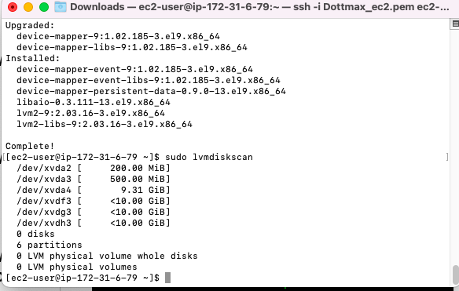

[^25]:This command installs the logical volume to check for availsble partition

# Mark each disk as physical lovems to be used by the logical volumes

`sudo pvcreate /dev/xvdf1 ` [^33]

`sudo pvcreate /dev/xvdg1 `

`sudo pvcreate /dev/xvdh1 `

[^33]:This is created for each attahced volume to mark them as physical volume to be used by lvm

`sudo pvs` [^41]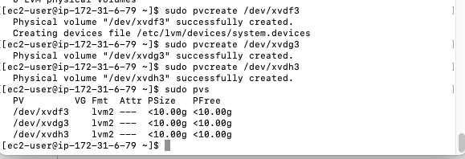

[^41]: This is done to verify that our pvs is working successfully

# Add all PVs  to a volume group 

`sudo vgcreate webdata-vg /dev/xvdh1 /dev/xvdg1 /dev/xvdf1` [^47]

 [^47]:We use this comman to add the PV to a volume group named webdata-vg

 `sudo vgs` [^51]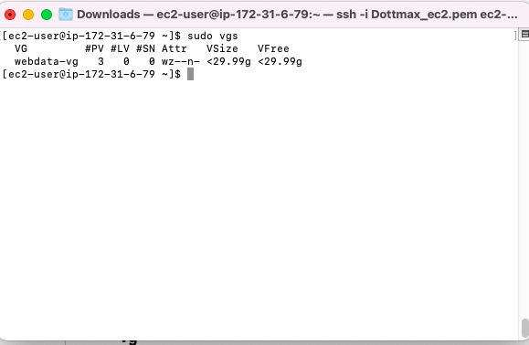

 [^51]:This command verifes that our volume group has been created successfully

 # create 2 logical volumes, one for the website and the other for the logs

 `sudo lvcreate -n apps-lv -L 14G webdata-vg` [^57]

 `sudo lvcreate -n logs-lv -L 14G webdata-vg`

 [^57]:This command creates 2 logical volumes namely apps and logs to store data for website and logs

 `sudo lvs` [^63]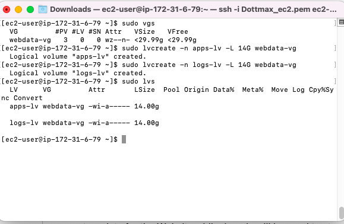
 
 [^63]: This command confirms that the lv is up and running

 `sudo vgdisplay -v #view complete setup - VG, PV, and LV` [^67]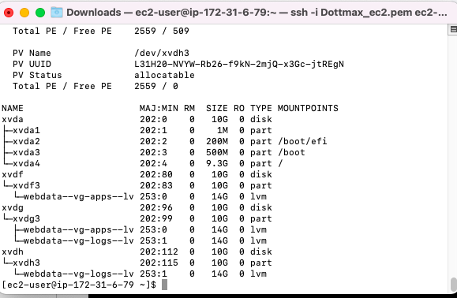

`sudo lsblk ` 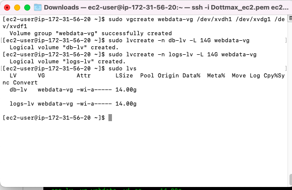

[^67]: This command confirms all set up on our webserver

# Format the logical volumes using ext4

`sudo mkfs -t ext4 /dev/webdata-vg/apps-lv `

`sudo mkfs -t ext4 /dev/webdata-vg/logs-lv `

# Create a var/www/html directory to store website files

`sudo mkdir -p /var/www/html `

# Create a home/recovery/logs directory to store logs

`sudo mkdir -p /home/recovery/logs `

# Mount var/www/html on apps-lv

`sudo mount /dev/webdata-vg/apps-lv /var/www/html/ `

`sudo rsync -av /var/log/. /home/recovery/logs/ ` [^91]

[^91]: This command backs up all the files in var/log to home/recovery/logs

# Mount var/log on logs-lv

`sudo mount /dev/webdata-vg/apps-lv /var/log`

# Restore logs back to var/log

`sudo rsync -av /home/recovery/logs/. /var/log`

# Update the /etc.fstab file

`sudo blkid` [^105]

[^105]: This command shows the UUID of both the log and apps

# update the UUID on the server

`sudo vi /etc/fstab` [^111]

# Test the configuration

`sudo mount -a`

# Reload the Daemon

`sudo systemctl daemon-reload`

# Verify that the whole set up is running

`df -h`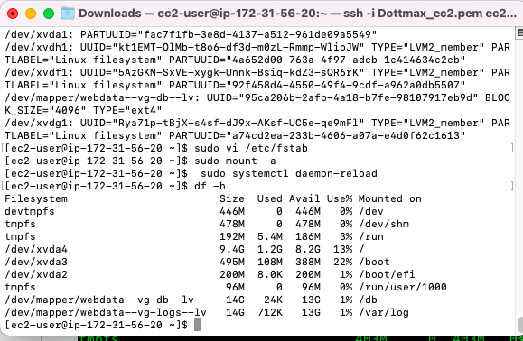

# Create an instance that will serve as a DB server using redHAt

on the created instance, attach 3 volumes each containing 10gib and attach it to the AZ of the created instance

`lsblk` [^129]

[^129]: This is done to view how the volumes are attached on the server

`ls /dev` [^133]

[^133]:This command shows the newly created volumes

`df -h` [^137]

# create a partition for each volume created

[^137]:This command shows how the volumes are mounted and the number of spaces

`gdisk /dev/xvdf` [^143]

[^143]:This command is used to create a single partition on the created volumes,so we do the same for each volume created

# Install logical volumes for each partition

`sudo yum install lvm2` 

`sudo lvmdiskscan ` [^151]

[^151]:This command installs the logical volume to check for availsble partition

# Mark each disk as physical lovems to be used by the logical volumes

`sudo pvcreate /dev/xvdf1 ` [^157]

`sudo pvcreate /dev/xvdg1 `

`sudo pvcreate /dev/xvdh1 `

[^157]:This is created for each attahced volume to mark them as physical volume to be used by lvm

`sudo pvs` [^165]

[^165]: This is done to verify that our pvs is working successfully

# Add all PVs  to a volume group 

`sudo vgcreate webdata-vg /dev/xvdh1 /dev/xvdg1 /dev/xvdf1` [^171]

 [^171]:We use this comman to add the PV to a volume group named webdata-vg

 `sudo vgs` [^175]

 [^175]:This comman verifes that our volume group has been created successfully

 # create 2 logical volumes, one for the database and the other for the logs

 `sudo lvcreate -n db-lv -L 14G webdata-vg` [^181]

 `sudo lvcreate -n logs-lv -L 14G webdata-vg`

 [^181]:This command creates 2 logical volumes namely apps and logs to store data for website and logs

 `sudo lvs` [^187]
 
 [^187]: This command confirms that the lv is up and running

 `sudo vgdisplay -v #view complete setup - VG, PV, and LV` [^191]

`sudo lsblk ` 

[^193]: This comman confirms all set up on our webserver

# Format the logical volumes using ext4

`sudo mkfs -t ext4 /dev/webdata-vg/db-lv `

`sudo mkfs -t ext4 /dev/webdata-vg/logs-lv `

# Create a var/www/html directory to store database files

`sudo mkdir -p /db `

# Create a home/recovery/logs directory to store logs

`sudo mkdir -p /home/recovery/logs `

# Mount var/www/html on apps-lv

`sudo mount /dev/webdata-vg/db-lv /db`

`sudo rsync -av /var/log/. /home/recovery/logs/ ` [^215]

[^215]: This command backs up all the files in var/log to home/recovery/logs

# Mount var/log on logs-lv

`sudo mount /dev/webdata-vg/db-lv /var/log`

# Restore logs back to var/log

`sudo rsync -av /home/recovery/logs/. /var/log`

# Update the /etc.fstab file

`sudo blkid` [^105]

[^105]: This command shows the UUID of both the log and apps

# update the UUID on the DB

`sudo vi /etc/fstab` [^111]

# Test the configuration

`sudo mount -a`

# Reload the Daemon

`sudo systemctl daemon-reload`

# Verify that the whole set up is running

`df -h`

# Install Wordpress on webserver

`sudo yum -y update`

# Install wget, apache and its dependencies

`sudo yum -y install wget httpd php php-mysqlnd php-fpm php-json`

# Start Apache

`sudo systemctl enable httpd`

`sudo systemctl start httpd`

# Install PHP and its dependencies
`sudo yum install https://dl.fedoraproject.org/pub/epel/epel-release-latest-8.noarch.rpm`

`sudo yum install yum-utils http://rpms.remirepo.net/enterprise/remi-release-8.rpm`

`sudo yum module list php`

`sudo yum module reset php`

`sudo yum module enable php:remi-7.4`

`sudo yum install php php-opcache php-gd php-curl php-mysqlnd`

`sudo systemctl start php-fpm`

`sudo systemctl enable php-fpm`

`sudo setsebool -P httpd_execmem 1`

# Restart Apache

`sudo systemctl restart httpd`

# Download wordpress and copy it to var/www/html

`mkdir wordpress`

`cd   wordpress`

`sudo wget http://wordpress.org/latest.tar.gz`

`sudo tar xzvf latest.tar.gz`

`sudo rm -rf latest.tar.gz`

`sudo cp wordpress/wp-config-sample.php wordpress/wp-config.php`

`sudo cp -R wordpress /var/www/html/`

# Configure SELinux Policies

`sudo chown -R apache:apache /var/www/html/wordpress`

`sudo chcon -t httpd_sys_rw_content_t /var/www/html/wordpress -R`

`sudo setsebool -P httpd_can_network_connect=1`

# Install MySQL on the DB server
`sudo yum update`

`sudo yum install mysql-server`

# Start mySQL

`sudo systemctl restart mysqld`

`sudo systemctl enable mysqld`

`sudo systemctl status mysqld`

# Configure DB to word with wordpress server

`sudo mysql`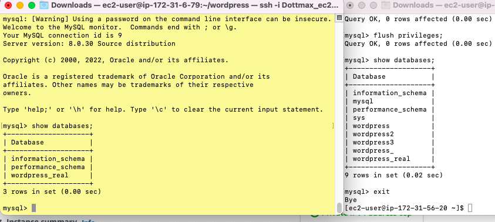

# Create a Database on our DB server

# Configure wordpress to connect to remote database

Open port 3306 on our DB server and allow access to only from the webserver

# Change the binding address on MySQL server to 0.0.0.0

`sudo vi /etc/my.cnf`

# Install MySQL- client and connect to DB server from wordpress server

`sudo yum install mysql`

`sudo mysql -u admin -p -h <DB-Server-Private-IP-address>`

# Change permission and configuration so Apache could connect to WordPress

`cd /var/www/html`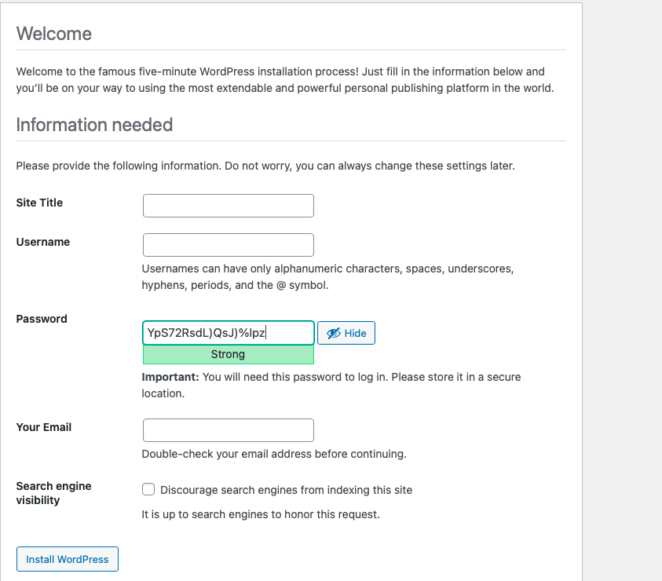

Open port 80 on the webserver and enable access from anywhere

Access wordpress from the webserver public address

